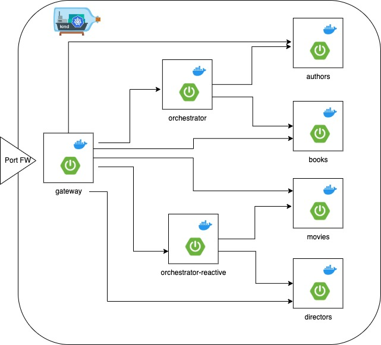

# SpringBootMicroServicesInKubernetes
This is an example project with Java Spring Boot micro-services architecture deployed on Kubernetes.
The purple of this project is to explore a micro services architecture realized with:

- Spring Boot 3 and Java 17
- Spring Boot Cloud features for Service Discovery, Spring Boot Gateway, Feign Client
- Kubernetes

I need to realize an architecture without Eureka as service discovery, using own Kubernetes features.
I want to use Spring boot Cloud Gateway as API Gateway instead of Zuul, even if Kubernetes can act as Gateway too.

The project contains the following components:
- gateway (Is the Ingress/Api gateway of all services)
- bookService (Classic Rest Microservice)
- authorService (Classic Rest Microservice)
- orchestratorService (Orchestrator for Classic Rest Microservice)
- movieService (Reactive Microservice)
- directorService (Reactive Microservice)
- orchestratorReactiveService (Orchestrator for Reactive Microservice)

## Requirements sowftware
You need to install in your computer:
- Java SDK 17
- Maven
- Git
- Docker
- <a href="https://kind.sigs.k8s.io/">Kind</a>

I'm not a devops, so if someone would like to give me some suggestions on how improves my k8s scripts, they are welcome.
For create the Kubernetes cluster in local with kind, you can use official kind documentation. I, personally, used this <a href="https://cloudyuga.guru/hands_on_lab/kind-k8s">"practical" guide</a>

## Structure of project
The project has a branch for each progressive step, so you can check out a branch for inspect a progressive step.
Inside doc directory there is a README-step-n.md file for each step. It contains the more important notes to remember.

### Branches details
- main --> the final result of the project
- step-1 --> bookService and authorService services running in local
- step-2 --> Create kind k8s cluster, local docker registry, k8s yaml script for deploy bookService and authorService
- step-3 --> Spring Cloud Gateway configuration and deploy in front of books and authors
- step-4 --> orchestrationService using Feign Client e Spring boot cloud discovery features
- step-5 --> movieService and directorService reactive services running in k8s behind the gateway properly configured
- step-6 --> orchestrationReactiveService for the reactive services of step 5

